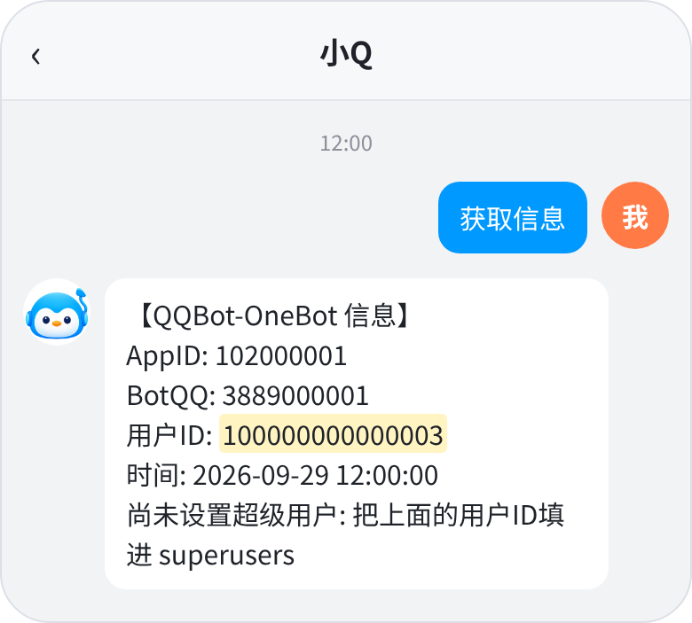
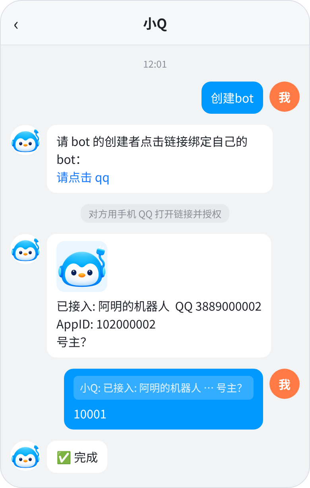
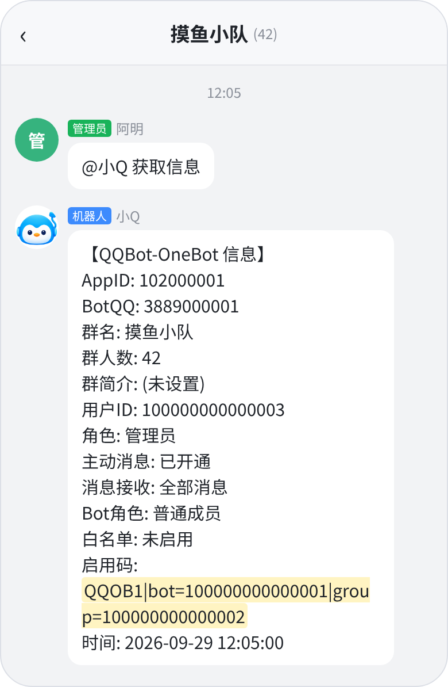
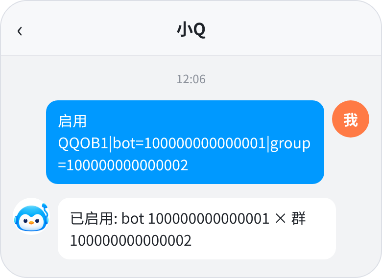

<div align="center">


# qqbot-onebot

**QQ 官方机器人 → OneBot v11**，简称 qbob

[](CHANGELOG.md)
[](pyproject.toml)
[](https://github.com/botuniverse/onebot-11)
[](https://bot.q.qq.com/wiki/)
[](https://docs.astral.sh/uv/)
[](LICENSE)

[部署](docs/deploy.md) · [管理台](docs/console.md) · [接口](docs/api.md) · [插件开发](docs/plugins.md) · [头像适配](docs/avatar.md) · [更新日志](CHANGELOG.md)

</div>

<p align="center"></p>

让 OneBot 时期资产直接用于QQ官方 bot，迁入官机的最好方式！

- 群聊、私聊的收发，图片、语音、视频、文件，引用与撤回
- 平台没有的能力尽量降级实现（表情回应 → 引用 + emoji，合并转发 → 网页链接）
- 聊天里一条 `创建bot` 就能接入新 bot，按群启用，支持自助创建和批量管理
- 直接对接 QQ 官方协议的框架也能透传接入原生官机框架

## 快速开始

推荐用 [uv](https://docs.astral.sh/uv/)（自动准备 Python 3.12 与依赖；不用 uv 的装法见[部署文档](docs/deploy.md#安装)）：

```bash
git clone https://github.com/Loping151/qbob && cd qbob
mkdir -p data && cp config.example.json data/config.json
./start.sh
```

默认管理台在 `http://127.0.0.1:17810`，初始密码见 `data/initial_admin_password.txt`，首次登录后按提示改掉。

> 如将控制台暴露至公网，请妥善防护；部署时避免使用高权限用户（如 root）。

<details>
<summary>作为系统服务运行（systemd）</summary>

先 `uv sync` 建好 `.venv`，再写入 `/etc/systemd/system/qqbot-onebot.service`：

```ini
[Unit]
Description=QQ official bot -> OneBot v11 adapter (qbob)
After=network-online.target
Wants=network-online.target

[Service]
Type=simple
User=YOUR_USER
WorkingDirectory=/path/to/qbob
ExecStart=/path/to/qbob/.venv/bin/python -m qqbot_onebot --config data/config.json
Restart=on-failure
RestartSec=5

[Install]
WantedBy=multi-user.target
```

```bash
sudo systemctl daemon-reload && sudo systemctl enable --now qqbot-onebot
journalctl -u qqbot-onebot -f
```

</details>

## 公网访问

以下功能需要一个指向本服务 17800 端口的 https 地址，填进 `public_base_url`：

- 用「合并转发转网页」，群友要打开网页
- 事件接收用 Webhook 模式
- 想从外网打开管理台

有公网 IP 用 nginx 等反向代理，没有就用 Cloudflare Tunnel、frp 等穿透，示例见[部署文档](docs/deploy.md#公网访问)。

## 典型场景

- **自己用**：一个官方 bot 直连自己的 nonebot2，无缝从napcat、llob、snowloma迁移。
- **托管**：自助创建 bot 用 `创建bot` 命令在聊天里接到你的后端，你按群批准启用；
  多套后端可以配合 [BotShepherd](https://github.com/Loping151/BotShepherd) 分发，或提供订阅接口（使用到期时间API）。
- **与官方协议框架共存**：已经在用 nonebot-adapter-qq、botpy 的，通过透传和 OneBot 后端共用同一个 bot。

## 使用流程

**1. 接入第一个 bot。** 管理台扫码或填 AppID / AppSecret。第一个连上的 bot 成为默认 bot。

**2. 设置 superuser。** 向 bot 发 `获取信息`，回复里的「用户ID」就是你在这个 bot 下的 id。
把它填进管理台「设置 → 选项」的全局 superusers（或该 bot 编辑里的 superusers），也可以停服务后写进 `data/config.json` 的 `superusers`。
私聊里谁都能用 `获取信息`；群里平时只有群主、管理员和 superuser 能用，初次部署（只有一个 bot、还没设过 superuser）时例外，谁都能用。

<p align="center"></p>

> 平台给每个 bot 的 openid 都不同，所以**同一个人、同一个群在不同 bot 下的 id 不同**。
> 框架保证 id 之间不冲突，且同一 bot 下同一用户或群的 id 永远不变。

**3. 配置默认后端。** 在管理台「设置 → 后端」配置**后端预设**（一组 OneBot 反向 WebSocket 地址，新 bot 按默认预设接入）：直连 OneBot（如 `ws://127.0.0.1:8080/onebot/v11/ws`），
或经 [BotShepherd](https://github.com/Loping151/BotShepherd)。

**4. 用 `创建bot` 接入更多 bot。** superuser 私聊或在群里发 `创建bot`，得到一个授权链接，
任何人点开授权就能把自己的 bot 连过来。默认要发 `创建bot` 的那位 superuser **引用 bot 的「号主？」并回复号主 QQ 号**来批准，
批准后按默认后端预设接入；回复的不是 QQ 号、或 1 小时没人回，就取消并删掉这个 bot。

<p align="center"></p>

**5. 在群里启用。** 群主先在群设置里给机器人打开「主动发言」和「接收全部消息」。
然后群管理员发 `获取信息`，把回复转给 superuser，superuser 对任意一个自己管的 bot 发 `启用` 加上这段回复：

<p align="center">
  
  
</p>

`禁用` 用法相同。

## 选项

管理台「设置 → 选项」：

- **群启用方式**：默认需要 superuser `启用`。如通过其他方式控制 bot 启用状态，选择总是启用即可（只影响之后新建的 bot，已有 bot 在各自的编辑里改）
- **要求接收全部消息**：默认开，群关掉全量接收即自动停用
- **询问号主**：默认开，关掉则 `创建bot` 授权后直接接入，号主记为「未知」
- **一次性撤回提示**：合并转发被拆成多条发出时，附一句「可回复本消息一次性撤回」
- **全局 superuser**、**默认 bot**

## 其他特性

- **插件**：长文本转图片、合并转发转网页、长链接收短，默认开启，可在管理台开关和配置。
  转网页没有配置可用地址时不生效。自定义插件见[插件开发](docs/plugins.md)
- **透传**：官方协议框架把 API 地址指向本服务的 `/qqapi/` 即可接入，见[接口文档](docs/api.md#透传qq-官方协议)
- **自身消息上报**：bot 自己发的消息也作为事件下发，插件可以互相触发
- **HTTP API**：除反向 WS 外，也可用 HTTP 调用 OneBot 动作

## OneBot 支持情况

**支持**：发消息（文本、图片、语音、视频、文件、引用）、撤回、`get_msg`、消息历史、
群信息、群禁言、入群申请审批、上传文件、取文件、登录信息等。
事件有群消息、私聊消息、bot 进退群、成员进退群、入群申请、好友添加、按钮点击。

**降级**：

| 能力 | 降级为 |
|---|---|
| 合并转发 | 群聊发一条网页链接；私聊逐条发送 |
| 表情回应 `set_msg_emoji_like` | 引用那条消息回一个 emoji |
| 戳一戳 | 一条「@对方 戳了戳你」 |
| @某人 | 群聊用 markdown 真 @；私聊为「@昵称」文本 |
| @全体成员 | 「@全体成员」文本 |
| QQ 表情 `face` | 对应的 emoji |
| 音乐、分享、卡片 | 标题加链接 |
| 群成员列表、好友列表、群列表 | 只有发过言、私聊过、已启用的 |
| 群荣誉、精华、公告、群文件列表等查询 | 返回空数据 |

**无法实现**（调用时静默，返回 `retcode=1404`）：全员禁言、踢人、设管理员、改群名片、改群名、退群、头衔、
匿名、群公告与精华的写入、群文件管理、点赞、删好友、OCR、cookies 等。
平台也不推送撤回、戳一戳、禁言等通知。

逐个动作的列表见[接口文档](docs/api.md#支持矩阵)。

## 已知限制

- **部分接口只能降级或无法实现**：官方 bot 能力有限，见上面的[支持情况](#onebot-支持情况)。
- **头像不能按 QQ 号拼**：`q.qlogo.cn/g?b=qq&nk=<ID>` 对 15 位 ID 不会报错，而是返回默认企鹅图，所以要按位数分流：
  15 位就调扩展接口 `get_additional_user_detail` 取头像地址。参考实现（nonebot2）：

```python
async def avatar_url(bot, user_id, size: int = 640) -> str:
    fallback = f"https://q.qlogo.cn/g?b=qq&nk={user_id}&s={size}"
    if not (len(str(user_id)) == 15 and str(user_id).isdigit()):
        return fallback
    try:
        data = await bot.call_api("get_additional_user_detail", user_id=int(user_id), size=size)
        return data["avatar"]["data"] or fallback   # size: 0 原图 / 100 / 640
    except Exception:
        return fallback
```

  AstrBot、Yunzai、gsuid_core 各框架的改法见[头像适配](docs/avatar.md)。

## 许可

始于 2026-08-12。

[AGPL-3.0](LICENSE)
